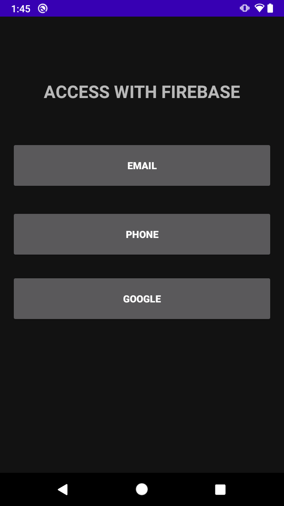
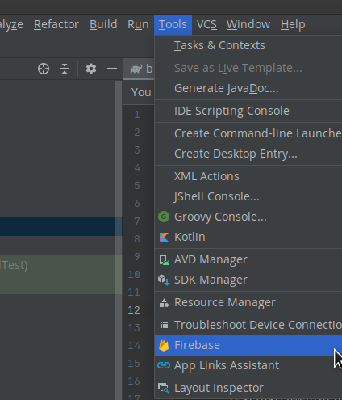
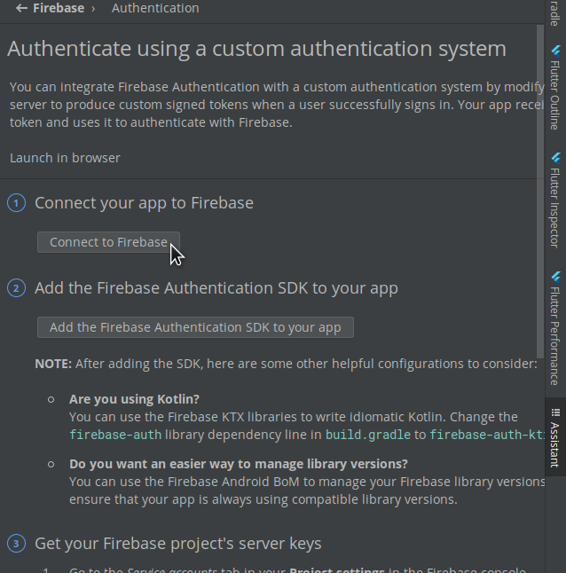
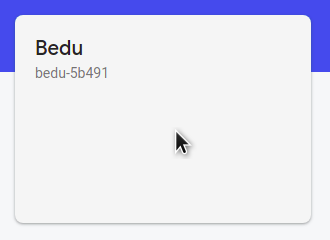
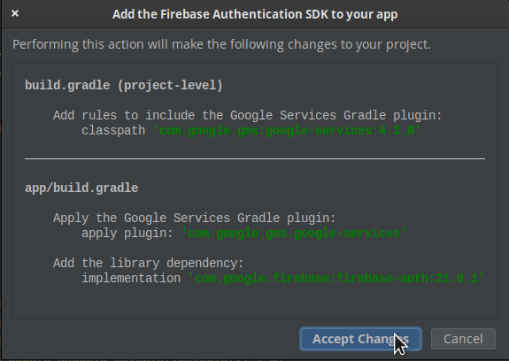

# Ejemplo 01: Implementar Firebase Authentication

## Objetivo

* Utilizar proyecto base
* Agregar Firebase Authentication al proyecto base
* Configurar Firebase Authentication

## Desarrollo

Vamos a implementar Firebase Authentication en un proyecto previamente creado.

Para esto, utilizaremos el [Proyecto base](./base) e iremos implementando las modificaciones.

1. Ejecutamos el proyecto base con Android Studio, tendremos la siguiente interfaz

    

2. Ahora agregaremos la librerías de Firebase, primero damos clic en Tools -> Firebase

    

3. Esto abrirá la siguiente venta, buscamos la opción de Authentication, damos clic y después en la tercera opción **Authentication using a custom authentication system**

    

4. Nos mostrará la siguiente venta, en la cual daremos clic en *Connect to Firebase*, este botón abrirá el navegador, seleccionamos nuestro proyecto y damos clic en *Conectar*

    

    

    

    Con esto tendremos nuestra app conectada a Firebase

    

5. Ahora vamos al paso 2 en Android studio, dando clic al botón *Add the firebase...* y aceptamos los cambios. 

    Esto Agrega *Play Services y Auth*

    

    

6. Vamos a Firebase console y activamos *Authentication*

    

Felicidades ya tienes Firebase Authentication en tu proyecto.

 

[Siguiente ](../Ejemplo-02/README.md)(Ejemplo 2)
