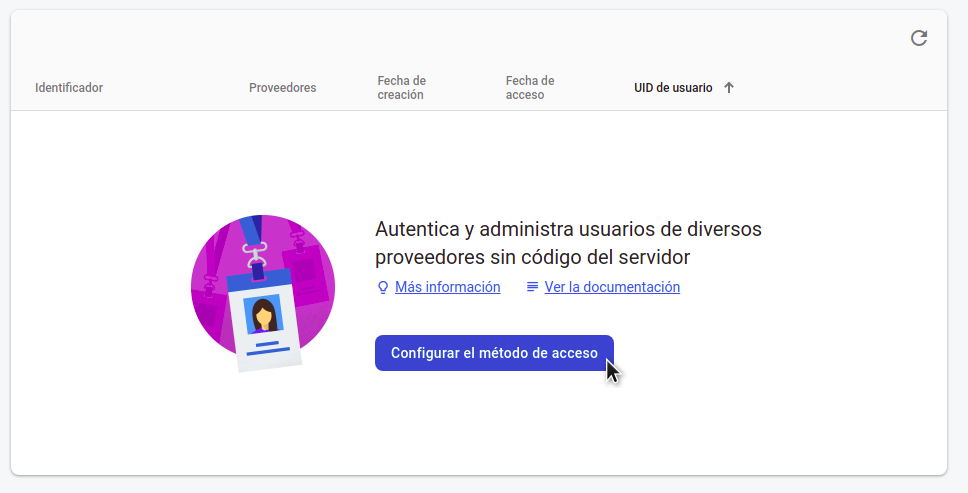
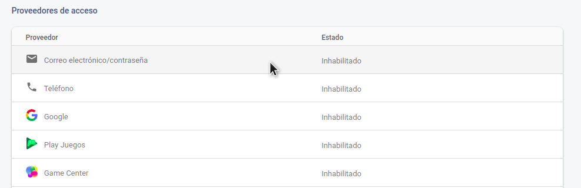
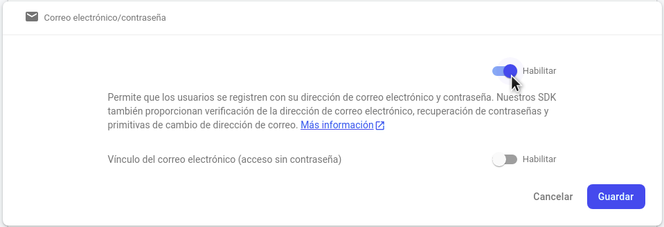
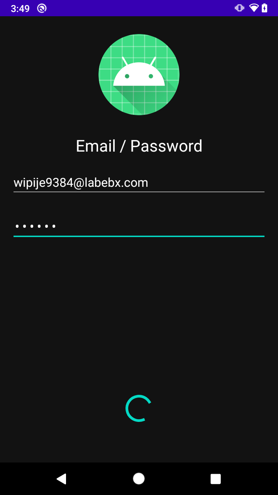
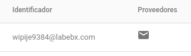

# Ejemplo 02: Registro con correo y contraseña

## Objetivo

* Conectar la interfaz con las llamadas de Auth
* Crear cuenta con correo y contraseña
* Notificar al usuario con las respuestad de Auth

## Desarrollo

1. Antes de modificar el código configuraremos el método de acceso en Firebase Console. En el menú Authentication, damos clic en *Configurar el método de acceso*

    

    Seleccionamos Correo electrónico/contraseña

    

    Habilitamos el primer check y damos clic en Guardar

    

2. Nos dirijimos al Gradle del proyecto y agregamos las siguientes dependencias y damos clic en **Sync Now**

    ```kotlin
    implementation platform('com.google.firebase:firebase-bom:28.0.1')
    implementation 'com.google.firebase:firebase-auth-ktx'
    ```

3. Ahora modificaremos la clase **MainActivity**

    Inicializando FirebaseApp

    ```kotlin
    //Dentro de onCreate
    FirebaseApp.initializeApp(this)
    ```

4. Ahora modificaremos **EmailActivity**

    ```kotlin
    //Declaramos la variable
    private lateinit var auth: FirebaseAuth
    ```

    ```kotlin
    //Dentro de onCreate
    auth = Firebase.auth
    ```

5. Agregamos la siguiente llamada a la función **createAccount** para registrar el correo y la contraseña que escribio el usuario en la interfaz.

    ```kotlin
    auth.createUserWithEmailAndPassword(email, password)
      .addOnCompleteListener(this) { task ->
          if (task.isSuccessful) {
            Log.d(TAG, "createUserWithEmail:success")
            val user = auth.currentUser
            updateUI(user, null)
          } else {
            Log.w(TAG, "createUserWithEmail:failure", task.exception)
            updateUI(null, task.exception)
          }
      }
      ```

      En ambas respuestas *(success - failure)* llamamos a la función *updateUI*, esta se encargará de mostrar los mensajes, así que la reemplzamos con el siguiente bloque de código:

      ```kotlin
      private fun updateUI(user: FirebaseUser?, exception: Exception?) {
        if (exception != null) {
          binding.loading.visibility = View.GONE
          binding.btnLogin.visibility = View.VISIBLE
          Utility.displaySnackBar(binding.root, exception.message.toString(), this, R.color.red)
        } else {
          Utility.displaySnackBar(binding.root, "Login was successful", this, R.color.green)
          binding.loading.visibility = View.GONE
          binding.btnLogin.visibility = View.VISIBLE
        }
      }
      ``` 

6. Ejecutamos la app y registramos una cuenta

    

    Depués de unos segundos deberíamos ver el siguiente mensaje

    

    En Firebase Console deberíamos ver el usuario registrado, en la penstaña de users

    

Felicidades ahora tu app puede registrar usuarios sin agregar código en el servidor

</br>

[Siguiente ](../Reto-01/README.md)(Reto 1)