# Ejemplo 03: Accede con número telefónico

## Objetivo

* Crear cuenta con número telefónico
* Iniciar sesión con número telefónico

## Desarrollo

Antes de modificar el código vamos a generar las huellas digitales de nuestro proyecto y activar API DeviceCheck. 

En Google Cloud Console, habilita la [API de Android DeviceCheck](https://console.cloud.google.com/apis/library/androidcheck.googleapis.com?authuser=0) en tu proyecto. Se usará la clave de API de Firebase predeterminada, y se debe tener acceso a la API de DeviceCheck.

  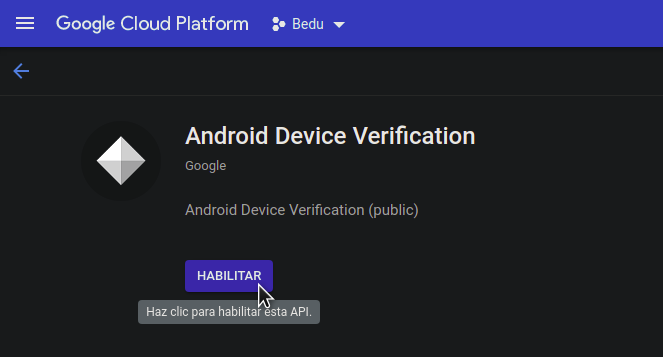

En Android studio damos clic en:

- Build -> Generate Signed Bundle or APK

  En el modal damos clic en Next

  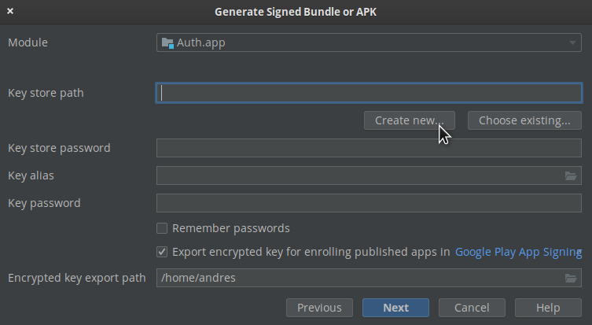

  Se recomienda agregar la siguiente información, ya que esta llave sólo se usará para pruebas.

  Contraseña: android
  Alias: android
  Name: debug

  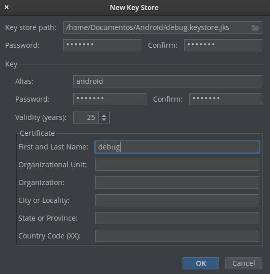

  Ya creada la llave, tendrá el nombre de **debug.keystore.jks** Eliminamos la extensión **.jks** quedará del siguiente modo **debug.keystore**

  


- Ya creada la llave vamos a

  File -> Project Structure -> Modules -> app -> Signing Configs

  Buscamos la lave, y agregamos los datos

  

  Después a la pestaña de *Default Config* y en la opción de *Signing Config* seleccionamos ***$signingConfigs.debug*** y luego en Ok

   

  Esto agrega la siguiente línea en el gradle

  ```kotlin
  signingConfigs {
    debug {
      storeFile file('/home/andres/Documentos/Android/DebugKey/debug.keystore')
      storePassword 'android'
      keyAlias 'android'
    }
  }
  ```

  - Para generar la huella ejecutamos la siguiente línea en la terminal

  ```hash
  /opt/android-studio/jre/bin/keytool -list -v -keystore /home/andres/Documentos/Android/DebugKey/debug.keystore -alias android -storepass android -keypass android
  ```

  >TIP: La primera parte es la ruta donde está instalado **keytool**, luego la ruta donde está la llave y después los datos de la llave

  La salida espera es:

  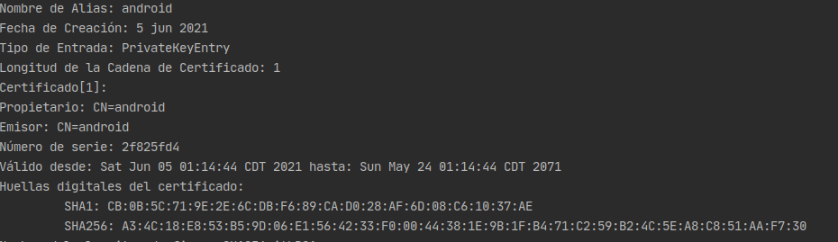

  >TIP: Guarda la clave SHA1 y SHA256

- Ahora configuraremos el método de acceso en Firebase Console. En el menú Authentication, seleccionamos la pestaña  *Sign-in method* y habilitamos *Teléfono*

  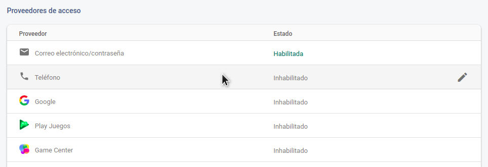

  Seleccionamos Teléfono y habilitamos el check

  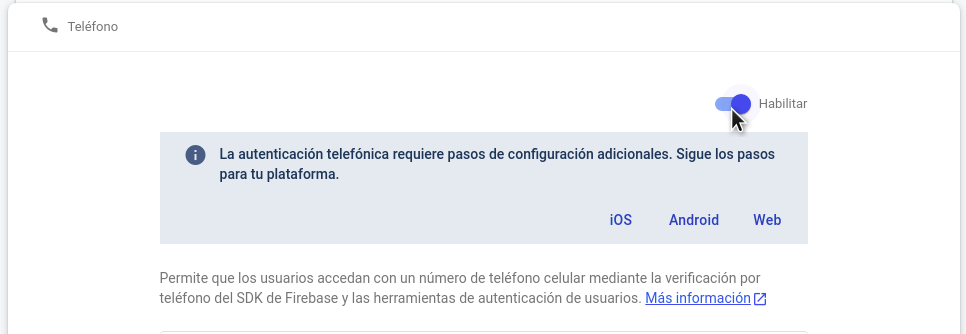

  Este método requiere unos pasos extra de configuración, ya que la verificación trabaja de dos maneras. ***"En el prework se explicaron estos modos"***

  Necesitamos agregar las huellas digitales de nuestra app. Primero vamos a la configuración del proyecto

  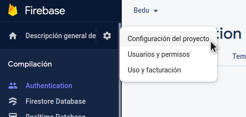

  Al final de la configuración encontramos un botón para *Agregar las huellas*

  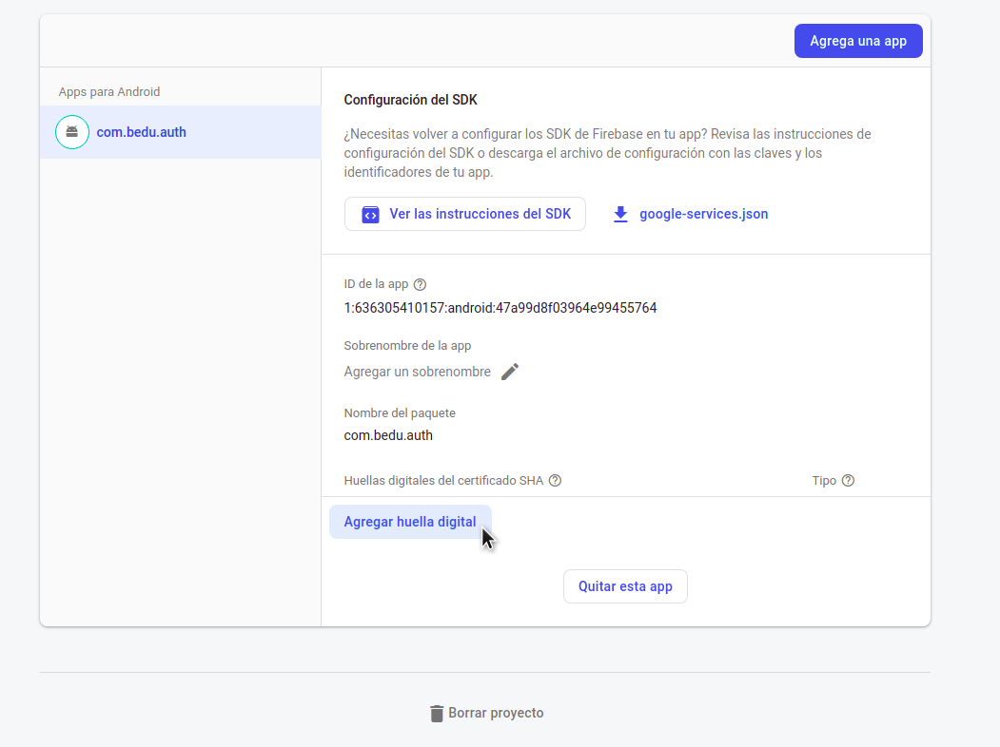

  Agregamos las dos huellas generadas, quedando de la siguiente manera

  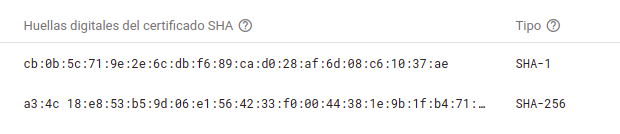

</br></br>

Ya configuradas las huellas vamos al código

1. Vamos a modificar **PhoneActivity**

    ```kotlin
    //Declaramos las variables
    private lateinit var auth: FirebaseAuth

    private var storedVerificationId: String? = ""
    private lateinit var resendToken: PhoneAuthProvider.ForceResendingToken
    private lateinit var callbacks: PhoneAuthProvider.OnVerificationStateChangedCallbacks
    ```

    ```kotlin
    //Dentro de onCreate
    auth = Firebase.auth
    ```

2. En el clic del botón enviamos las variables declaradas

    ```kotlin
    ...
    resendVerificationCode(phone, resendToken)
    ...
    storedVerificationId?.let { it1 -> verifyPhoneNumberWithCode(it1, code) }
    ...
    ```

3. Agregamos el callback de responses

    ```kotlin
    callbacks = object : PhoneAuthProvider.OnVerificationStateChangedCallbacks() {

      override fun onVerificationCompleted(credential: PhoneAuthCredential) {
        Log.d(TAG, "onVerificationCompleted:$credential")
        signInWithPhoneAuthCredential(credential)
      }

      override fun onVerificationFailed(e: FirebaseException) {
        Log.w(TAG, "onVerificationFailed", e)

        binding.edtPhone.visibility = View.VISIBLE
        binding.btnContinue.visibility = View.VISIBLE
        binding.loading.visibility = View.GONE

        when (e) {
          is FirebaseAuthInvalidCredentialsException -> {
            // Invalid request
            Utility.displaySnackBar(
              binding.root,
              "Invalid request",
              this@PhoneActivity,
              R.color.red
            )
          }
          is FirebaseTooManyRequestsException -> {
            // The SMS quota for the project has been exceeded
            Utility.displaySnackBar(
              binding.root,
              "The SMS quota for the project has been exceeded",
              this@PhoneActivity,
              R.color.red
            )
          }
          else -> {
            Utility.displaySnackBar(
              binding.root,
              e.message.toString(),
              this@PhoneActivity,
              R.color.red
            )
          }
        }
      }

      override fun onCodeSent(
        verificationId: String,
        token: PhoneAuthProvider.ForceResendingToken
      ) {
        Log.d(TAG, "onCodeSent:$verificationId")

        binding.btnContinue.visibility = View.VISIBLE
        binding.edtCode.visibility = View.VISIBLE
        binding.loading.visibility = View.GONE

        Utility.displaySnackBar(
          binding.root,
          "Code sent",
          this@PhoneActivity,
          R.color.green
        )

        storedVerificationId = verificationId
        resendToken = token
      }
    }
    ```

4. Cambiamos el tipo de variable para token en la función *resendVerificationCode*

    ```Kotlin
    token: PhoneAuthProvider.ForceResendingToken?
    ```

5. Modificamos la función *startPhoneNumberVerification*  con lo siguiente:

    ```Kotlin
    val options = PhoneAuthOptions.newBuilder(auth)
      .setPhoneNumber(phoneNumber)       // Phone number to verify
      .setTimeout(60L, TimeUnit.SECONDS) // Timeout and unit
      .setActivity(this)                 // Activity (for callback binding)
      .setCallbacks(callbacks)          // OnVerificationStateChangedCallbacks
      .build()
    PhoneAuthProvider.verifyPhoneNumber(options)
    ```

6. Agregamos la siguiente función **createAccount** para validar las credenciales:

    ```kotlin
    private fun signInWithPhoneAuthCredential(credential: PhoneAuthCredential) {
      auth.signInWithCredential(credential)
        .addOnCompleteListener(this) { task ->
          if (task.isSuccessful) {
            // Sign in success, update UI with the signed-in user's information
            Log.d(TAG, "signInWithCredential:success")

            val user = task.result?.user
            updateUI(user, null)
          } else {
            // Sign in failed, display a message and update the UI
            Log.w(TAG, "signInWithCredential:failure", task.exception)
            if (task.exception is FirebaseAuthInvalidCredentialsException) {
              // The verification code entered was invalid

              binding.loading.visibility = View.GONE
              binding.btnContinue.visibility = View.VISIBLE
              binding.btnContinue.text = "Resend code"

              Utility.displaySnackBar(
                  binding.root,
                  "The verification code entered was invalid",
                  this@PhoneActivity,
                  R.color.red
              )
            } else {
                task.exception?.let { updateUI(null, it) }
            }
              // Update UI
            }
          }
    }
      ```

      En ambas respuestas *(success - failure)* llamamos a la función *updateUI*, esta se encargará de mostrar los mensajes, así que la reemplazamos con el siguiente bloque de código:

      ```kotlin
      private fun updateUI(user: FirebaseUser?, exception: Exception?) {
        binding.edtPhone.visibility = View.VISIBLE
        if (exception != null) {
          binding.loading.visibility = View.GONE
          binding.btnContinue.visibility = View.VISIBLE
          Utility.displaySnackBar(binding.root, exception.message.toString(), this, R.color.red)
        } else {
          Utility.displaySnackBar(binding.root, "Login was successful", this, R.color.green)
          binding.loading.visibility = View.GONE
          binding.btnContinue.visibility = View.VISIBLE
        }
      }
      ``` 

7. Ejecutamos la app y registramos un número telefónico

    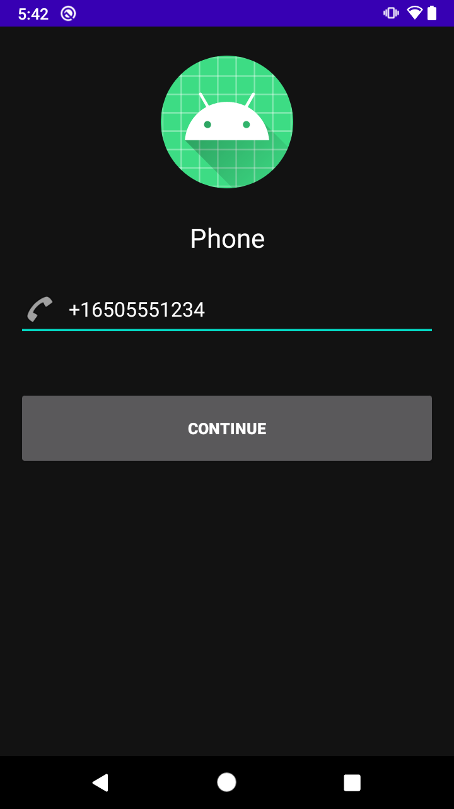

    Después de unos segundos deberíamos ver el siguiente mensaje

    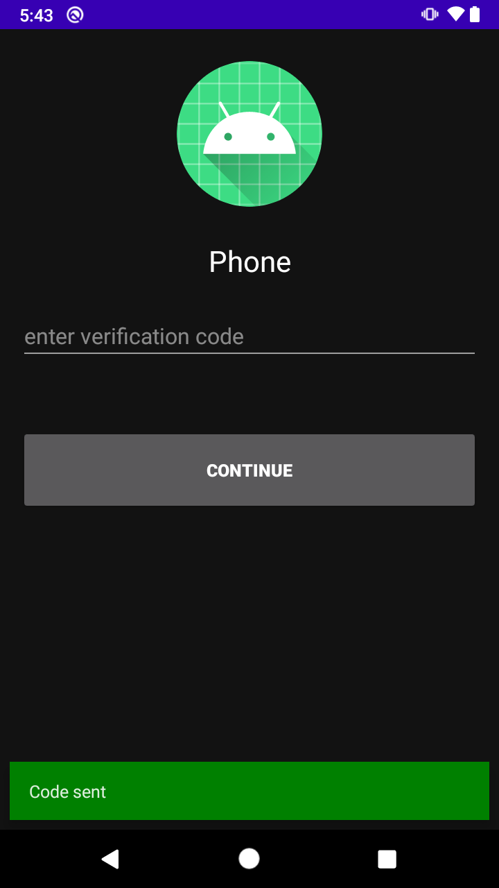

    Si utilizaste tu número de teléfono deberías de recibir un mensaje de texto con el código

Felicidades ahora tu app puede enviar códigos de verificación, en el siguiente reto validará el código y concluirá el registro.

</br>

[Siguiente ](../Reto-02/README.md)(Reto 2)