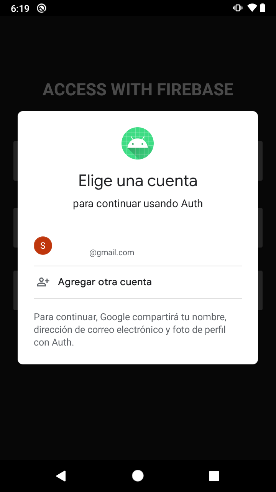
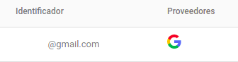

# Postwork 1 - Acceso con Google

En los ejemplos de está sesión aprendimos a iniciar sesión y registrar usuarios sin agregar código del lado del servidor.
Para el primer postwork queremos poner en practica, lo que ya aprendiste. El proyecto base tiene el botón de Google, cuando demos clic en este botón no debe permitir iniciar sesión con algún correo de Google. Te recomendamos apoyarte con la [documentación](https://firebase.google.com/docs/auth/android/google-signin)

## Objetivo

* Agrega inicio con Google

## Desarrollo

> TIPS: 
> - Recuerda habilitar el inicio por Google en Firebase Console
> - Agregar la dependencia
>   - implementation 'com.google.android.gms:play-services-auth:19.0.0'
> - Puedes hacer la implementación en el *MainActivity*

Propuesta de flujo



</br>



<details>
  <summary>Solución</summary>
    
  ```kotlin
  // Variables
  private lateinit var auth: FirebaseAuth

  private lateinit var googleSignInClient: GoogleSignInClient
  ```

  ```kotlin
  // Dentro de onCreate
  FirebaseApp.initializeApp(this)

  val gso = GoogleSignInOptions.Builder(GoogleSignInOptions.DEFAULT_SIGN_IN)
      .requestIdToken(getString(R.string.default_web_client_id))
      .requestEmail()
      .build()

  googleSignInClient = GoogleSignIn.getClient(this, gso)

  auth = Firebase.auth
  ```

  ```kotlin
  // onClick btnGoogle
  binding.btnGoogle.setOnClickListener {
    val signInIntent = googleSignInClient.signInIntent
    startActivityForResult(signInIntent, RC_SIGN_IN)
  }
  ```

  ```kotlin
  // Funciones nuevas
  override fun onActivityResult(requestCode: Int, resultCode: Int, data: Intent?) {
        super.onActivityResult(requestCode, resultCode, data)

        // Result returned from launching the Intent from GoogleSignInApi.getSignInIntent(...);
        if (requestCode == RC_SIGN_IN) {
            val task = GoogleSignIn.getSignedInAccountFromIntent(data)
            try {
                // Google Sign In was successful, authenticate with Firebase
                val account = task.getResult(ApiException::class.java)!!
                Log.d(TAG, "firebaseAuthWithGoogle:" + account.id)
                firebaseAuthWithGoogle(account.idToken!!)
            } catch (e: ApiException) {
                // Google Sign In failed, update UI appropriately
                Log.w(TAG, "Google sign in failed", e)
                Utility.displaySnackBar(binding.root, "Google sign in failed", this, R.color.red)
            }
        }
    }

    private fun firebaseAuthWithGoogle(idToken: String) {
      val credential = GoogleAuthProvider.getCredential(idToken, null)
      auth.signInWithCredential(credential)
        .addOnCompleteListener(this) { task ->
          if (task.isSuccessful) {
            // Sign in success, update UI with the signed-in user's information
            Log.d(TAG, "signInWithCredential:success")
            val user = auth.currentUser
            updateUI(user, null)
          } else {
            // If sign in fails, display a message to the user.
            Log.w(TAG, "signInWithCredential:failure", task.exception)
            updateUI(null, task.exception)
          }
        }
    }

    private fun updateUI(user: FirebaseUser?, exception: Exception?) {
      binding.btnGoogle.visibility = View.VISIBLE
      if (exception != null) {
        binding.loading.visibility = View.GONE
        binding.btnGoogle.visibility = View.VISIBLE
        Utility.displaySnackBar(binding.root, exception.message.toString(), this, R.color.red)
      } else {
        Utility.displaySnackBar(binding.root, "Login was successful: ", this, R.color.green)
        binding.loading.visibility = View.GONE
        binding.btnGoogle.visibility = View.VISIBLE
      }
    }
  ```

</details>

</br>
</br>

[Regresar ](../README.md)(Sesión 01)

