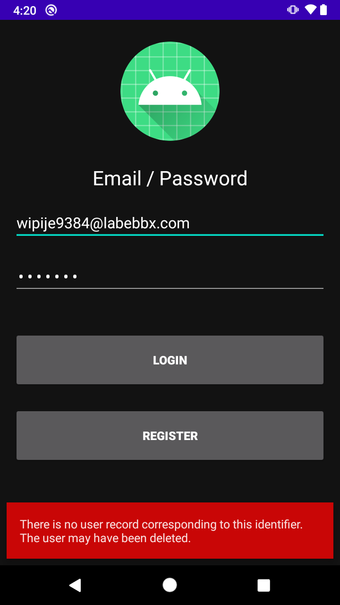
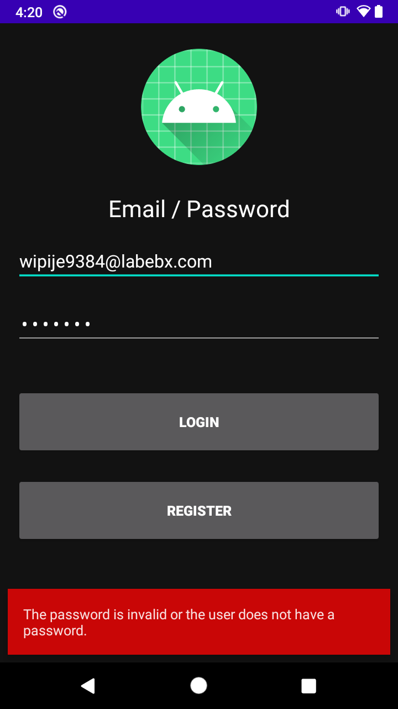
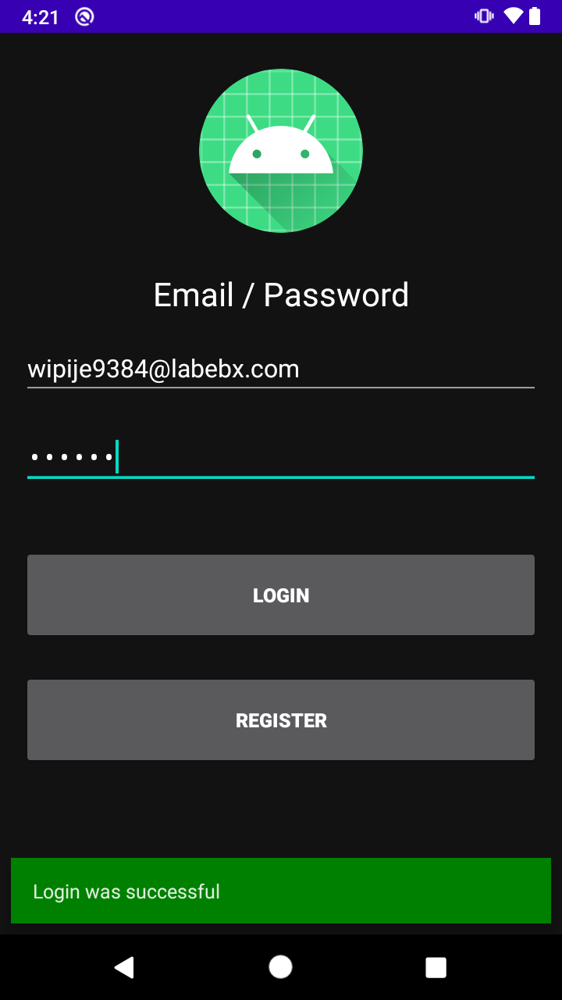

# Reto 01: Iniciar sesión

En el ejemplo 2 agregamos la función para crear usuarios

## Objetivo

* Agregar inicio de sesión
* Mostrar mensajes
  * Registro no encontrado
  * Contraseña errónea
  * Bienvenido

## Desarrollo

Agregar inicio de sesión con Auth, el código es muy similar al registro, solo cambia de **createUserWithEmailAndPassword** a **signInWithEmailAndPassword**

El resultado esperado debe ser similar a 







</br>

<details>
    <summary>Solución</summary>
    
```kotlin
private fun signIn(email: String, password: String) {
  auth.signInWithEmailAndPassword(email, password)
    .addOnCompleteListener(this) { task ->
      if (task.isSuccessful) {
        Log.d(TAG, "signInWithEmail:success")
        val user = auth.currentUser
        updateUI(user, null)
      } else {
        Log.w(TAG, "signInWithEmail:failure", task.exception)
        task.exception?.let { updateUI(null, it) }
      }
    }
}
```
</details>

</br>

> Las llamadas a Firebase retornan excepciones, por eso no tuvimos que agregar los mensajes de manera manual **task.exception**


</br>

[Siguiente ](../Ejemplo-03/README.md)(Ejemplo 3)