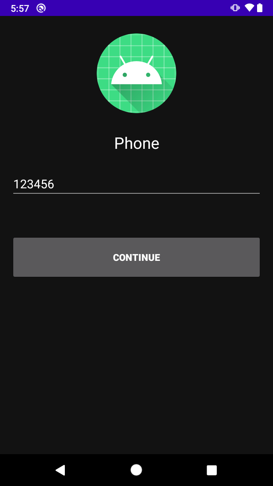
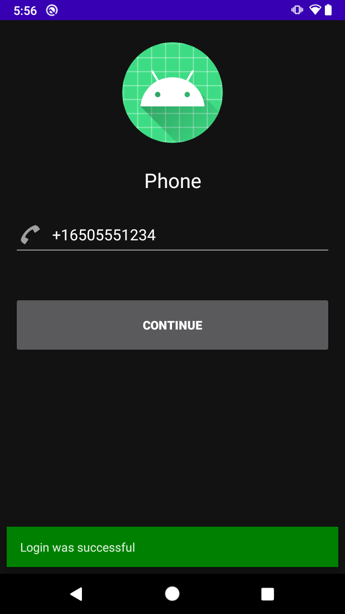
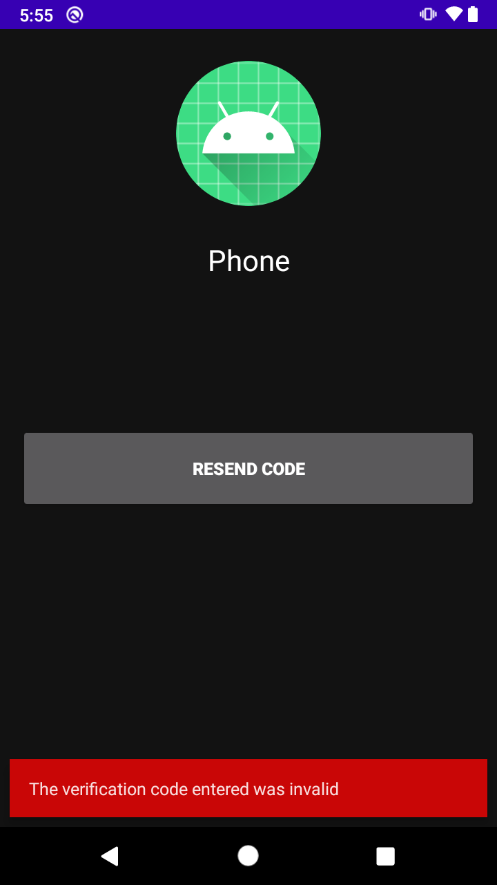
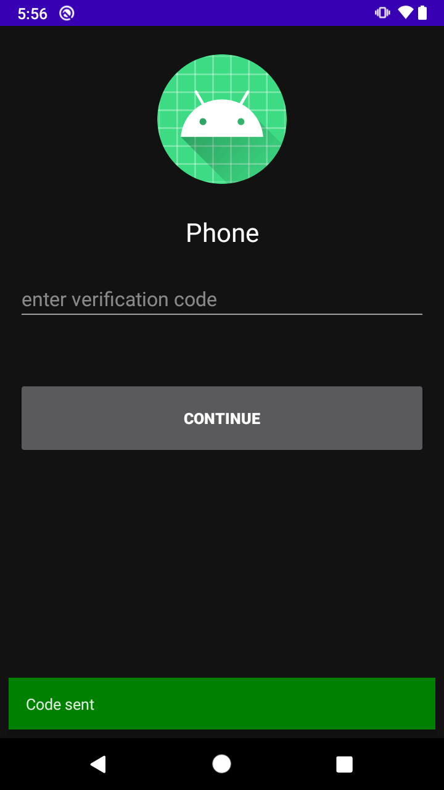

# Reto  02: Verificar y reenviar código

En el ejemplo 3 solicitamos el código para registrar usuario con número telefónico, ahora concluimos el registro.

## Objetivo

1. Validar código enviado por Auth para concluir registro
2. Solicitar nuevo código si el nuestro ya expiró

## Desarrollo


1. Crear PhoneAuthProvider con el código de verificación y el code que recibió por SMS, después solicitar la comprobación con la función **signInWithPhoneAuthCredential**, el resto lo hará *updateUI*

    > TIP: Crear Provider -> PhoneAuthProvider.getCredential(verificationId, userCode)

    El resultado esperado debe ser similar a 

    

    

    </br>

    <details>
      <summary>Solución</summary>
        
      ```kotlin
      private fun verifyPhoneNumberWithCode(verificationId: String, code: String) {
        val credential = PhoneAuthProvider.getCredential(verificationId, code)
        signInWithPhoneAuthCredential(credential)
      }
      ```
    </details>

  </br>

</br>

2. Si el código ya expiró o lo escribimos mal, agregar acción al botón actual, para solicitar un nuevo código, agregar la petición en la función **resendVerificationCode**

    > TIP: La llamada es muy similar a **startPhoneNumberVerification**

    El resultado esperado debe ser similar a 

    

    

    

    </br>

    <details>
      <summary>Solución</summary>
        
      ```kotlin
      private fun resendVerificationCode(
        phoneNumber: String,
        token: PhoneAuthProvider.ForceResendingToken?
      ) {
        val optionsBuilder = PhoneAuthOptions.newBuilder(auth)
          .setPhoneNumber(phoneNumber)       // Phone number to verify
          .setTimeout(60L, TimeUnit.SECONDS) // Timeout and unit
          .setActivity(this)                 // Activity (for callback binding)
          .setCallbacks(callbacks)          // OnVerificationStateChangedCallbacks
        if (token != null) {
          optionsBuilder.setForceResendingToken(token) // callback's ForceResendingToken
        }
        PhoneAuthProvider.verifyPhoneNumber(optionsBuilder.build())
      }
      ```
    </details>

    </br>

Comprobar que el registro se hizo correctamente


</br>
</br>

[Siguiente ](../Postwork/README.md)(Postwork)

